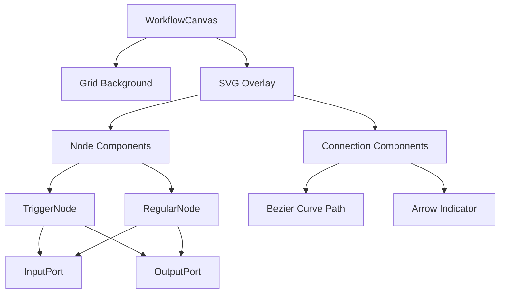
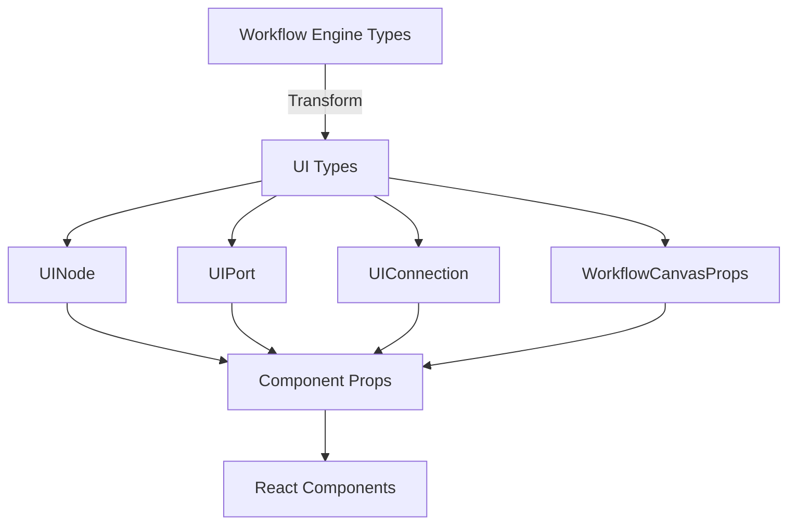
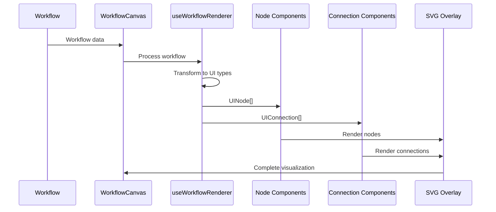

# Architecture Diagram: Workflow UI Visualization

## Component Hierarchy



## Data Flow Architecture

```mermaid
graph LR
    A[Workflow Engine] -->|Workflow Data| B[WorkflowCanvas]
    B -->|Process| C[useWorkflowRenderer]
    C -->|UINode[]| D[Node Components]
    C -->|UIConnection[]| E[Connection Components]
    C -->|UIPort[]| F[Port Components]
    D --> G[SVG Rendering]
    E --> G
    F --> G
    B -->|Grid Config| H[Grid Component]
    H --> I[Canvas Rendering]
```

## Component Structure

```
┌─────────────────────────────────────────────────────────────┐
│                      WorkflowCanvas                         │
│  ┌──────────────────────────────────────────────────────┐  │
│  │              Canvas (Grid Background)                 │  │
│  └──────────────────────────────────────────────────────┘  │
│  ┌──────────────────────────────────────────────────────┐  │
│  │                   SVG Overlay                         │  │
│  │  ┌──────────────┐      ┌──────────────┐             │  │
│  │  │ TriggerNode  │      │ RegularNode  │             │  │
│  │  │ ┌──┐    ┌──┐ │      │ ┌──┐    ┌──┐ │             │  │
│  │  │ │○ │    │ ○│ │      │ │○ │    │ ○│ │             │  │
│  │  │ └──┘    └──┘ │      │ └──┘    └──┘ │             │  │
│  │  └──────────────┘      └──────────────┘             │  │
│  │         │                      │                      │  │
│  │         └──────────────────────┘                      │  │
│  │              Connection (Bezier Curve)                │  │
│  └──────────────────────────────────────────────────────┘  │
└─────────────────────────────────────────────────────────────┘
```

## File Structure

```
workflow-ui/
├── package.json                    # Dependencies and scripts
├── tsconfig.json                   # TypeScript configuration
├── vite.config.ts                  # Vite configuration
├── README.md                       # Package documentation
│
├── src/
│   ├── components/
│   │   ├── WorkflowCanvas/
│   │   │   ├── WorkflowCanvas.tsx           # Main canvas container
│   │   │   ├── WorkflowCanvas.module.css    # Canvas styling
│   │   │   └── types.ts                     # Canvas-specific types
│   │   │
│   │   ├── Node/
│   │   │   ├── Node.tsx                     # Base node component
│   │   │   ├── TriggerNode.tsx              # Trigger node variant
│   │   │   ├── RegularNode.tsx              # Regular node variant
│   │   │   ├── Node.module.css              # Node styling
│   │   │   └── types.ts                     # Node-specific types
│   │   │
│   │   ├── Port/
│   │   │   ├── InputPort.tsx                # Input port component
│   │   │   ├── OutputPort.tsx               # Output port component
│   │   │   ├── Port.module.css              # Port styling
│   │   │   └── types.ts                     # Port-specific types
│   │   │
│   │   ├── Connection/
│   │   │   ├── Connection.tsx               # Connection line component
│   │   │   ├── Connection.module.css        # Connection styling
│   │   │   └── types.ts                     # Connection-specific types
│   │   │
│   │   └── Grid/
│   │       ├── Grid.tsx                     # Grid background component
│   │       └── Grid.module.css              # Grid styling
│   │
│   ├── hooks/
│   │   ├── useWorkflowRenderer.ts           # Workflow data processing
│   │   ├── useCanvasTransform.ts            # Zoom/pan logic (future)
│   │   └── useNodeLayout.ts                 # Node positioning
│   │
│   ├── utils/
│   │   ├── bezierCurve.ts                   # Bezier curve calculations
│   │   ├── nodeLayout.ts                    # Layout calculations
│   │   ├── colorUtils.ts                    # Color utilities
│   │   └── workflowTransform.ts             # Data transformation
│   │
│   ├── types/
│   │   ├── ui.ts                            # UI-specific types
│   │   └── index.ts                         # Type exports
│   │
│   └── demo/
│       ├── App.tsx                          # Demo application
│       ├── main.tsx                         # Entry point
│       └── index.html                       # HTML template
│
└── public/                                  # Static assets
```

## Type System Architecture



## Rendering Pipeline



## State Management

```
┌─────────────────────────────────────┐
│       WorkflowCanvas State          │
├─────────────────────────────────────┤
│ - workflow: Workflow                │
│ - dimensions: { width, height }     │
│ - transform: { zoom, pan } (future) │
└─────────────────────────────────────┘
            │
            ├─────────────────────┐
            ↓                     ↓
┌─────────────────────┐  ┌─────────────────────┐
│   Node State        │  │ Connection State    │
├─────────────────────┤  ├─────────────────────┤
│ - id: string        │  │ - id: string        │
│ - position: Point   │  │ - path: string      │
│ - state: NodeState  │  │ - type: LinkType    │
│ - ports: UIPort[]   │  │ - source: string    │
└─────────────────────┘  │ - target: string    │
                         └─────────────────────┘
```

## Styling Architecture

```
┌─────────────────────────────────────┐
│        CSS Modules                  │
├─────────────────────────────────────┤
│ WorkflowCanvas.module.css           │
│ - Canvas container                  │
│ - Layout and positioning            │
├─────────────────────────────────────┤
│ Node.module.css                     │
│ - Node base styles                  │
│ - State-specific colors             │
│ - Trigger vs Regular variants       │
├─────────────────────────────────────┤
│ Port.module.css                     │
│ - Port circle styles                │
│ - Hover effects                     │
│ - Data type colors                  │
├─────────────────────────────────────┤
│ Connection.module.css               │
│ - Path stroke styles                │
│ - Arrow indicators                  │
│ - Connection type colors            │
├─────────────────────────────────────┤
│ Grid.module.css                     │
│ - Grid line styles                  │
│ - Background colors                 │
└─────────────────────────────────────┘
```

## Color System

```
Node States:
├── Idle:    #f0f0f0 (bg) / #999 (border)
├── Running: #fff7e6 (bg) / #ffa940 (border)
├── Success: #f6ffed (bg) / #52c41a (border)
└── Error:   #fff1f0 (bg) / #ff4d4f (border)

Node Types:
├── Trigger: #e6f7ff (bg) / #1890ff (border)
└── Regular: #f0f0f0 (bg) / #999 (border)

Connections:
├── Standard:    #999
└── Alternative: #1890ff

Ports:
├── Default:     #999
├── Main:        #1890ff
└── Alternative: #52c41a

Grid:
├── Lines:      #e0e0e0
└── Background: #fafafa
```

## Coordinate System

```
Canvas Coordinate System:
┌────────────────────────────────────► X (width)
│  (0,0)
│    ┌──────────────┐
│    │   Node 1     │ (x: 0, y: 0)
│    └──────────────┘
│
│           ┌──────────────┐
│           │   Node 2     │ (x: 200, y: 0)
│           └──────────────┘
│
│                      ┌──────────────┐
│                      │   Node 3     │ (x: 400, y: 0)
│                      └──────────────┘
▼
Y (height)

Node Dimensions:
- Width: 240px
- Height: 80px (base) + (port_count * 24px)
- Position: [x, y] from top-left corner

Port Positions:
- Input ports: x = node.x - 8 (left edge)
- Output ports: x = node.x + 240 + 8 (right edge)
- Y offset: node.y + 40 + (index * 24)
```

## Integration Points

```
┌─────────────────────────────────────┐
│      Workflow Engine Package        │
│                                     │
│  - Workflow class                   │
│  - Node interfaces                  │
│  - Port interfaces                  │
│  - Connection interfaces            │
└──────────────┬──────────────────────┘
               │
               │ Import
               ↓
┌─────────────────────────────────────┐
│       Workflow UI Package           │
│                                     │
│  - WorkflowCanvas component         │
│  - Data transformation utilities    │
│  - UI-specific types                │
│  - Visual components                │
└─────────────────────────────────────┘
               │
               │ Render
               ↓
┌─────────────────────────────────────┐
│         Browser (Demo App)          │
│                                     │
│  - React application                │
│  - Canvas + SVG rendering           │
│  - User interaction (future)        │
└─────────────────────────────────────┘
```

## Performance Considerations

```
Optimization Strategy:
├── Canvas for static elements (Grid)
│   └── Renders once, no re-renders
├── SVG for dynamic elements (Nodes, Connections)
│   ├── React.memo for Node components
│   ├── React.memo for Connection components
│   └── useMemo for expensive calculations
├── Virtualization (future)
│   └── Only render visible nodes
└── Debounced updates (future)
    └── Throttle zoom/pan updates
```

## Future Extension Points

```
Phase 2: Enhanced Visualization
├── Zoom controls (useCanvasTransform hook)
├── Pan controls (useCanvasTransform hook)
├── Minimap (new component)
└── Search/filter (new component)

Phase 3: Interactive Editing
├── Drag-and-drop (new hooks)
├── Connection creation (new handlers)
├── Node palette (new component)
└── Configuration panel (new component)
```

## Testing Strategy

```
Unit Tests:
├── Utility functions
│   ├── bezierCurve.ts
│   ├── nodeLayout.ts
│   └── colorUtils.ts
└── Hooks
    ├── useWorkflowRenderer
    └── useNodeLayout

Component Tests:
├── Node rendering
├── Port rendering
├── Connection rendering
└── Canvas rendering

Integration Tests:
├── Full workflow rendering
├── State updates
└── Data transformation

Visual Tests:
├── Screenshot comparison
└── Manual browser testing
```

## Dependencies

```json
{
  "dependencies": {
    "react": "^18.2.0",
    "react-dom": "^18.2.0"
  },
  "devDependencies": {
    "@types/react": "^18.2.0",
    "@types/react-dom": "^18.2.0",
    "@vitejs/plugin-react": "^4.0.0",
    "typescript": "^5.3.3",
    "vite": "^5.0.0"
  }
}
```

## Build Output

```
dist/
├── index.html              # Demo application HTML
├── assets/
│   ├── index-[hash].js     # Bundled JavaScript
│   └── index-[hash].css    # Bundled CSS
└── components/             # Exported components (if library)
    ├── WorkflowCanvas.js
    ├── Node.js
    ├── Port.js
    └── Connection.js
```

